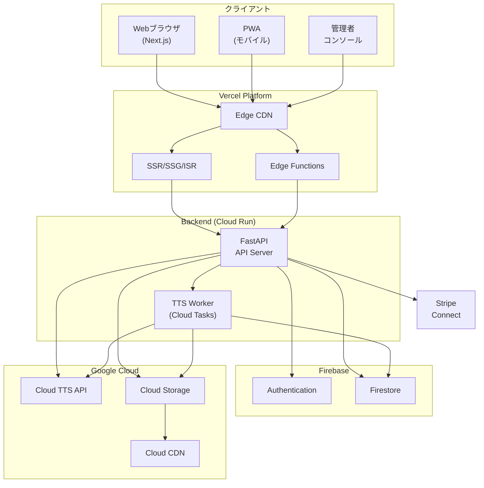
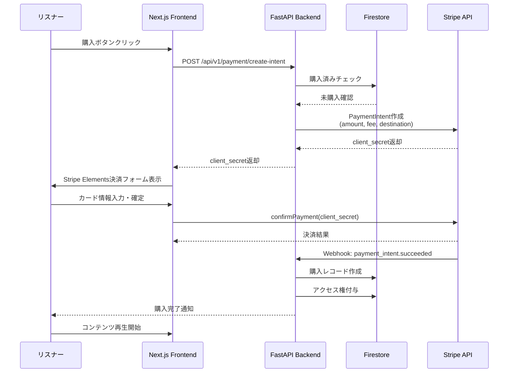

# 音声配信・ブログ統合プラットフォーム ソフトウェア仕様書

**ドキュメントバージョン:** 1.0  
**作成日:** 2026-03-27  
**ステータス:** 初版  
**分類:** 要件定義および基本設計

---

## 目次

1. [システム概要と目的](#1-システム概要と目的)
2. [アクターと権限モデル](#2-アクターと権限モデル)
3. [機能要件](#3-機能要件)
4. [非機能要件](#4-非機能要件)
5. [システムアーキテクチャ図](#5-システムアーキテクチャ図)
6. [主要なデータモデル](#6-主要なデータモデル)
7. [主要なAPIエンドポイント一覧](#7-主要なapiエンドポイント一覧)

---

## 1. システム概要と目的

### 1.1 プロジェクトビジョン

本システムは、ビジネス書・自己啓発本などのテキストコンテンツを音声化し、ストリーミング配信するプラットフォームである。Amazon Audibleに類似した音声ストリーミング配信と、テキストベースのブログ記事管理機能を統合し、クリエイターがコンテンツを制作・販売できるマーケットプレイスを提供する。

### 1.2 ビジネス目的

| 目的 | 説明 |
|------|------|
| コンテンツの民主化 | 個人クリエイターが専門的な録音設備なしに音声コンテンツを生成・販売可能にする |
| マルチフォーマット対応 | テキスト（ブログ）と音声の両形式でコンテンツを提供し、ユーザーの利用シーンを拡大 |
| スケーラブルな収益モデル | Stripeを用いた安全な決済基盤により、プラットフォーム手数料による持続的収益を確保 |
| 高可用性 | フェイルセーフ設計により、APIや外部サービスの障害時にもサービス継続を保証 |

### 1.3 スコープ定義

**スコープ内:**
- ユーザー認証・認可（Firebase Authentication）
- ブログ記事の作成・編集・公開・管理（CMS機能）
- Google Cloud TTS APIを用いた音声合成パイプライン（SSML対応）
- 音声ストリーミング再生（レジューム再生対応）
- コンテンツ販売・決済機能（Stripe連携）
- クリエイターダッシュボード（売上・アナリティクス）
- 管理者用コンテンツモデレーション機能

**スコープ外（将来フェーズ）:**
- ネイティブモバイルアプリ（iOS/Android）
- ライブ音声配信機能
- AIによるコンテンツレコメンデーションエンジン
- 多言語コンテンツの自動翻訳
- サブスクリプション（定額聴き放題）モデル

### 1.4 前提条件と制約

| 区分 | 内容 |
|------|------|
| 前提条件 | Google Cloudプロジェクトが構成済みであり、TTS APIが有効化されていること |
| 前提条件 | Firebaseプロジェクトが作成済みで、Firestore/Authentication/Storageが利用可能であること |
| 前提条件 | Stripeアカウント（Connect対応）が準備済みであること |
| 前提条件 | Vercelアカウントが準備済みで、カスタムドメインが設定可能であること |
| 制約 | Google Cloud TTS APIのレート制限（デフォルト: 1,000リクエスト/分） |
| 制約 | Firestoreの単一ドキュメントサイズ上限（1MB） |
| 制約 | Stripeの決済通貨はJPYを主、USDを副とする |

---

## 2. アクターと権限モデル

### 2.1 アクター定義

本システムには以下の3種のアクターが存在する。

#### 2.1.1 リスナー（Listener）

一般ユーザー。コンテンツの閲覧・視聴・購入を行う。

- アカウント登録・ログイン（Email/Password、Google OAuth、Apple ID）
- 無料コンテンツの閲覧・視聴
- 有料コンテンツの購入・視聴
- お気に入り登録・再生履歴管理
- レビュー・評価の投稿
- 再生位置のレジューム（端末間同期）
- プロフィール編集

#### 2.1.2 クリエイター（Creator）

コンテンツ制作者。リスナーの全権限に加え、以下の権限を持つ。

- ブログ記事の作成・編集・公開・非公開・削除
- 記事の音声変換リクエスト（TTS実行）
- SSML編集による音声カスタマイズ
- 音声ファイルの直接アップロード（自前録音音声）
- コンテンツの価格設定・販売管理
- 売上ダッシュボードの閲覧
- Stripe Connect口座の連携・出金管理
- コンテンツのアナリティクス（再生数、購入数、レビュー統計）

#### 2.1.3 システム管理者（Admin）

プラットフォーム運営者。全権限に加え、以下の管理権限を持つ。

- ユーザー管理（アカウント停止・復帰・ロール変更）
- コンテンツモデレーション（不適切コンテンツの非公開・削除）
- プラットフォーム手数料率の設定
- システム設定（TTS設定、ストレージポリシーなど）
- 売上レポート・プラットフォーム全体のアナリティクス
- 障害対応ダッシュボードへのアクセス

### 2.2 権限マトリクス

| 機能 | リスナー | クリエイター | 管理者 |
|------|----------|-------------|--------|
| コンテンツ閲覧・検索 | ✅ | ✅ | ✅ |
| 無料コンテンツ視聴 | ✅ | ✅ | ✅ |
| 有料コンテンツ購入 | ✅ | ✅ | ✅ |
| お気に入り・履歴管理 | ✅ | ✅ | ✅ |
| レビュー投稿 | ✅ | ✅ | ✅ |
| ブログ記事作成・管理 | ❌ | ✅ | ✅ |
| TTS音声変換リクエスト | ❌ | ✅ | ✅ |
| 音声ファイル直接アップロード | ❌ | ✅ | ✅ |
| コンテンツ販売・価格設定 | ❌ | ✅ | ✅ |
| 売上ダッシュボード | ❌ | ✅（自身のみ） | ✅（全体） |
| Stripe口座管理 | ❌ | ✅ | ❌ |
| ユーザー管理 | ❌ | ❌ | ✅ |
| コンテンツモデレーション | ❌ | ❌ | ✅ |
| システム設定 | ❌ | ❌ | ✅ |

### 2.3 ロールの昇格フロー

```
未認証ユーザー → [アカウント登録] → リスナー → [クリエイター申請 + 審査承認] → クリエイター
                                                    → [管理者による任命] → システム管理者
```

クリエイターへの昇格条件:
1. 本人確認情報の提出（氏名、連絡先）
2. Stripe Connectアカウントの連携完了
3. 利用規約・クリエイター契約への同意
4. 管理者による承認（自動承認オプションあり）

---

## 3. 機能要件

### 3.1 ブログ・コンテンツ管理機能（CMS）

#### 3.1.1 記事作成・編集

**FR-CMS-001: リッチテキストエディタ**
- Markdown記法またはWYSIWYGエディタによる記事作成
- 見出し（H1-H4）、太字、斜体、リスト、引用、コードブロック対応
- 画像・動画の埋め込み（GCS へのアップロード、最大10MB/画像）
- 下書き保存（自動保存: 30秒間隔）
- プレビュー機能（公開時のレンダリング確認）

**FR-CMS-002: 記事メタデータ管理**
- タイトル（最大200文字）
- 概要/抜粋（最大500文字）
- カテゴリ（階層構造、最大3カテゴリ同時指定）
- タグ（最大10個、フリーテキスト）
- サムネイル画像
- SEOメタ情報（meta title, meta description, OGP画像）
- 公開ステータス: draft / scheduled / published / archived
- 公開予約日時（scheduled 時）

**FR-CMS-003: 記事バージョニング**
- 記事の編集履歴を保持（最大20バージョン）
- 任意のバージョンへのロールバック機能
- バージョン間の差分表示

**FR-CMS-004: コンテンツ検索・フィルタリング**
- 全文検索（タイトル、本文、タグ）
- カテゴリ・タグによるフィルタリング
- ソート: 新着順、人気順（再生数/閲覧数）、評価順
- ページネーション（1ページあたり20件、カーソルベース）

**FR-CMS-005: コンテンツシリーズ管理**
- 複数の記事/音声を「シリーズ」としてグループ化
- シリーズ内の順序管理（ドラッグ&ドロップ）
- シリーズ単位での一括販売設定

#### 3.1.2 カテゴリ・タグ管理

**FR-CMS-010: カテゴリ体系**

```
ビジネス
  ├── 経営戦略
  ├── マーケティング
  ├── リーダーシップ
  └── ファイナンス
自己啓発
  ├── マインドセット
  ├── 習慣形成
  ├── コミュニケーション
  └── 時間管理
テクノロジー
  ├── AI・機械学習
  ├── プログラミング
  ├── プロダクト開発
  └── データサイエンス
ライフスタイル
  ├── 健康・ウェルネス
  ├── マネー・投資
  └── キャリア
```

### 3.2 音声合成パイプライン

#### 3.2.1 アーキテクチャ概要

```
[クリエイター] → [Next.js Frontend] → [FastAPI Backend]
                                           │
                                    ┌──────┼──────────┐
                                    ▼      ▼          ▼
                              [テキスト前処理] [SSML生成] [チャンク分割]
                                    │      │          │
                                    └──────┼──────────┘
                                           ▼
                                  [Google Cloud TTS API]
                                           │
                                           ▼
                                  [音声チャンク結合]
                                           │
                                           ▼
                                  [GCS へアップロード]
                                           │
                                           ▼
                                  [Firestore メタデータ更新]
```

#### 3.2.2 テキスト前処理

**FR-TTS-001: テキストクリーニング**
- HTML/Markdownタグの除去
- 不要な空白・改行の正規化
- 特殊文字のエスケープ処理
- URLの読み上げ用テキスト変換（例:「リンク先参照」）
- 数値の読み上げ最適化（例: ¥1,000,000 → 百万円）

**FR-TTS-002: 長文分割ロジック**

Google Cloud TTS APIの入力制限（5,000バイト/リクエスト）に対応するため、以下のロジックでテキストを分割する。

```
分割優先順位:
  1. 章・セクション境界（H1-H4見出し）
  2. 段落境界（空行区切り）
  3. 文境界（句点「。」「.」で分割）
  4. 読点「、」「,」で分割（最終手段）

各チャンク制約:
  - 最大サイズ: 4,500バイト（安全マージン500バイト）
  - 最小サイズ: 100バイト（極端な小分割を回避）
  - 文の途中での分割禁止
```

**FR-TTS-003: SSML生成エンジン**

Markdown/プレーンテキストからSSMLへの変換ルール:

| 入力要素 | SSML変換 |
|---------|---------|
| 見出し（H1-H4） | `<break time="1.5s"/>` + 強調読み上げ |
| 段落区切り | `<break time="0.8s"/>` |
| 句点「。」 | `<break time="0.4s"/>` |
| 読点「、」 | `<break time="0.2s"/>` |
| 太字テキスト | `<emphasis level="strong">` |
| 引用ブロック | `<prosody rate="90%" pitch="-2st">` |
| リスト項目 | `<break time="0.3s"/>` + 番号/マーカー読み上げ |
| 数式・コード | 読み上げスキップ + 「コードブロック省略」挿入 |

SSML出力例:
```xml
<speak>
  <break time="1.5s"/>
  <prosody rate="95%">
    <emphasis level="strong">第一章 リーダーシップの本質</emphasis>
  </prosody>
  <break time="1.0s"/>
  <p>
    リーダーシップとは、単に人を導くことではありません。
    <break time="0.4s"/>
    それは、ビジョンを示し、
    <break time="0.2s"/>
    チーム全体を鼓舞する力です。
  </p>
  <break time="0.8s"/>
</speak>
```

**FR-TTS-004: 音声パラメータ設定**

| パラメータ | デフォルト値 | 範囲 | 説明 |
|-----------|------------|------|------|
| language_code | ja-JP | ja-JP, en-US 等 | 音声言語 |
| voice_name | ja-JP-Neural2-B | TTS voice一覧参照 | 音声モデル |
| speaking_rate | 1.0 | 0.5 - 2.0 | 読み上げ速度 |
| pitch | 0.0 | -10.0 - 10.0 | ピッチ調整（半音） |
| volume_gain_db | 0.0 | -10.0 - 10.0 | 音量ゲイン |
| audio_encoding | MP3 | MP3, OGG_OPUS, LINEAR16 | 出力音声形式 |
| sample_rate_hertz | 24000 | 8000 - 48000 | サンプリングレート |

**FR-TTS-005: 音声チャンク結合処理**

```
処理フロー:
  1. 各チャンクのTTS結果（MP3バイナリ）を取得
  2. ffmpegを使用してチャンクを結合
  3. 結合後のノーマライズ処理（ラウドネス: -16 LUFS）
  4. チャプターマーカーのメタデータ埋め込み（ID3タグ）
  5. 最終音声ファイルをGCSへアップロード
  6. Firestoreのコンテンツドキュメントを更新
```

#### 3.2.3 非同期処理とジョブ管理

**FR-TTS-010: 音声変換ジョブキュー**

- Cloud Tasks または Celery + Redis による非同期ジョブ管理
- ジョブステータス: queued → processing → merging → uploading → completed / failed
- リアルタイム進捗通知（WebSocket または Firestore onSnapshot）
- リトライポリシー: 最大3回、エクスポネンシャルバックオフ（初回5秒、最大60秒）
- タイムアウト: 単一チャンク30秒、全体ジョブ30分

**FR-TTS-011: ジョブ優先度管理**

| 優先度 | 条件 | 最大同時実行数 |
|--------|------|---------------|
| HIGH | 有料コンテンツの初回変換 | 10 |
| MEDIUM | 無料コンテンツの初回変換 | 5 |
| LOW | 再変換（パラメータ変更） | 3 |

### 3.3 オーディオプレイヤー・ストリーミング再生機能

#### 3.3.1 プレイヤー要件

**FR-PLAYER-001: コアプレイヤー機能**
- 再生/一時停止/停止
- シークバー（タッチ・クリック対応）
- 音量調整（ミュート切替含む）
- 再生速度変更: 0.5x, 0.75x, 1.0x, 1.25x, 1.5x, 2.0x
- 10秒戻し / 30秒送り（スキップボタン）
- チャプター表示・チャプタージャンプ
- バックグラウンド再生対応（PWA / Media Session API）
- ミニプレイヤー（ページ遷移時も再生継続）

**FR-PLAYER-002: ストリーミング配信方式**

```
方式: 署名付きURL + レンジリクエスト（Byte-Range Request）

フロー:
  1. クライアントが再生リクエスト送信（コンテンツID + 認証トークン）
  2. FastAPIが購入済み/無料コンテンツかを検証
  3. GCS署名付きURLを生成（有効期限: 1時間）
  4. クライアントが署名付きURLへRange Headerで直接アクセス
  5. GCSがChunked Transfer Encodingでストリーミング応答

署名付きURL生成パラメータ:
  - 有効期限: 3600秒
  - 許可HTTPメソッド: GET, HEAD
  - IP制限: オプション（不正利用検知時に有効化）
```

**FR-PLAYER-003: レジューム再生**

```
再生位置同期ロジック:
  - 保存トリガー:
    1. 5秒ごとの定期保存（debounce処理）
    2. 一時停止時
    3. ページ離脱時（beforeunload / visibilitychange）
    4. アプリバックグラウンド移行時

  - 保存先: Firestore（users/{uid}/playback_positions/{contentId}）
  - 保存データ:
    {
      contentId: string,
      positionSeconds: number,
      totalDurationSeconds: number,
      playbackSpeed: number,
      updatedAt: Timestamp,
      deviceId: string
    }

  - 復元ロジック:
    1. コンテンツ再生開始時にFirestoreから最新位置を取得
    2. 保存位置が全体の98%以上なら先頭から再生（完聴扱い）
    3. 保存位置の2秒前から再生開始（聞き逃し防止）
    4. 複数デバイス間では最新のupdatedAtを優先
```

**FR-PLAYER-004: 再生キュー・プレイリスト**
- 次に再生するコンテンツのキュー管理
- プレイリスト作成・編集・削除
- シリーズ内の連続再生
- シャッフル・リピート（1曲/全曲）

#### 3.3.2 オフライン対応（将来フェーズ）

- Service Workerによる音声キャッシュ
- ダウンロード機能（DRM保護付き）
- オフライン再生ライセンス管理

### 3.4 販売・決済機能

#### 3.4.1 販売モデル

**FR-PAY-001: 価格設定**

| 販売タイプ | 説明 | 価格範囲 |
|-----------|------|---------|
| 無料公開 | 誰でも閲覧・視聴可能 | ¥0 |
| 単品購入 | 個別コンテンツの買い切り | ¥100 - ¥50,000 |
| シリーズ一括購入 | シリーズ全コンテンツのセット販売 | ¥500 - ¥100,000 |
| 投げ銭（チップ） | 任意金額の応援機能 | ¥100 - ¥50,000 |

**FR-PAY-002: 収益分配モデル**

```
収益分配:
  クリエイター取り分: 80%
  プラットフォーム手数料: 20%
  （Stripe決済手数料3.6%はプラットフォーム負担から控除）

計算例:
  コンテンツ価格: ¥1,000
  Stripe手数料: ¥36 (3.6%)
  プラットフォーム取り分: ¥200 - ¥36 = ¥164
  クリエイター取り分: ¥800
```

#### 3.4.2 Stripe連携

**FR-PAY-010: Stripe Connect統合**

```
クリエイター登録フロー:
  1. クリエイターがダッシュボードで「売上受取を設定」をクリック
  2. Stripe Connect Onboardingフローへリダイレクト
  3. 本人確認・銀行口座情報を入力（Stripe側で処理）
  4. Webhookでaccount.updated受信 → Firestoreのクリエイタープロフィール更新
  5. charges_enabledがtrueになったら販売機能を有効化

購入フロー:
  1. リスナーが購入ボタンをクリック
  2. FastAPIがStripe PaymentIntentを作成
     - amount: コンテンツ価格
     - application_fee_amount: プラットフォーム手数料
     - transfer_data.destination: クリエイターのStripe Connect ID
  3. フロントエンドでStripe Elements決済フォームを表示
  4. 決済確定 → Webhook（payment_intent.succeeded）受信
  5. Firestoreで購入レコード作成 + コンテンツアクセス権付与
```

**FR-PAY-011: Webhook処理**

| Webhookイベント | 処理内容 |
|----------------|---------|
| payment_intent.succeeded | 購入レコード作成、アクセス権付与、クリエイターへ通知 |
| payment_intent.payment_failed | 購入失敗通知、リトライ案内 |
| charge.refunded | アクセス権取消、返金レコード作成 |
| account.updated | クリエイターStripeアカウント状態更新 |
| payout.paid | 出金完了通知 |
| payout.failed | 出金失敗通知、サポートエスカレーション |

**FR-PAY-012: 返金ポリシー**
- 購入後7日以内: 全額返金可能
- 購入後7日超: 返金不可（例外は管理者判断）
- 返金時のアクセス権取消は即時
- 返金手数料はプラットフォーム負担

#### 3.4.3 クリエイターダッシュボード

**FR-PAY-020: 売上アナリティクス**
- 売上サマリー（日次/週次/月次/年次）
- コンテンツ別売上ランキング
- 購入者数推移グラフ
- 再生回数・完聴率レポート
- 売上CSV/PDFエクスポート

**FR-PAY-021: 出金管理**
- 出金可能残高の表示
- 出金スケジュール設定（即時/週次/月次）
- 出金履歴一覧
- 最低出金額: ¥1,000

---

## 4. 非機能要件

### 4.1 パフォーマンスとスケーラビリティ

#### 4.1.1 パフォーマンス目標

| 指標 | 目標値 | 測定方法 |
|------|--------|---------|
| ページ初期表示（LCP） | < 2.5秒 | Lighthouse / Web Vitals |
| API応答時間（P50） | < 200ms | FastAPI ミドルウェアログ |
| API応答時間（P95） | < 500ms | FastAPI ミドルウェアログ |
| API応答時間（P99） | < 1,000ms | FastAPI ミドルウェアログ |
| 音声再生開始遅延 | < 1.0秒 | クライアントサイド計測 |
| TTS変換スループット | 1,000文字/秒 | ジョブモニタリング |
| 検索クエリ応答 | < 300ms | Firestoreクエリログ |
| 同時接続ストリーミング | 10,000セッション | ロードテスト |

#### 4.1.2 スケーラビリティ設計

**フロントエンド（Next.js on Vercel）:**
- SSG（Static Site Generation）: カテゴリページ、ランディングページ
- ISR（Incremental Static Regeneration）: コンテンツ一覧（再生成間隔: 60秒）
- SSR（Server-Side Rendering）: 個別コンテンツページ（SEO + 動的データ）
- CSR（Client-Side Rendering）: ダッシュボード、プレイヤーUI
- Vercel Edge Functions: 認証チェック、地域別ルーティング

**バックエンドAPI（FastAPI）:**
- Cloud Run によるオートスケーリング
  - 最小インスタンス: 2（コールドスタート回避）
  - 最大インスタンス: 50
  - CPU: 2 vCPU / インスタンス
  - メモリ: 2GB / インスタンス
  - 同時リクエスト: 80 / インスタンス
- ステートレス設計（セッション情報はFirestoreに保存）

**データベース（Firestore）:**
- 自動スケーリング（Firestore Native Mode）
- 複合インデックスの最適化（高頻度クエリに対応）
- Firestoreのホットスポット回避設計（ドキュメントIDにランダムプレフィックス）

**ストレージ（GCS）:**
- マルチリージョン（asia-northeast1 優先）
- CDN連携（Cloud CDN or Vercel Edge Network）
- 音声ファイルのキャッシュ戦略:
  - 無料コンテンツ: Cache-Control: public, max-age=86400
  - 有料コンテンツ: 署名付きURL（キャッシュなし）

#### 4.1.3 キャッシュ戦略

| レイヤー | 対象 | TTL | 無効化トリガー |
|---------|------|-----|---------------|
| CDN Edge | 静的アセット（JS/CSS/画像） | 1年 | デプロイ時ハッシュ変更 |
| CDN Edge | 無料音声ファイル | 24時間 | コンテンツ更新時 |
| API レスポンス | コンテンツ一覧 | 60秒 | ISR再生成 |
| API レスポンス | コンテンツ詳細 | 30秒 | Firestore更新時 |
| クライアント | 再生位置 | リアルタイム | 5秒ごと同期 |
| Firestore | クエリキャッシュ | 自動 | ドキュメント変更時 |

### 4.2 高可用性とフェイルセーフ設計

#### 4.2.1 可用性目標

| 項目 | 目標 |
|------|------|
| サービス全体の稼働率 | 99.9%（月間ダウンタイム < 43分） |
| API可用性 | 99.95% |
| 音声ストリーミング可用性 | 99.9% |
| 決済処理可用性 | 99.99%（Stripe依存） |

#### 4.2.2 フェイルセーフ設計パターン

**パターン1: TTS API障害時のフォールバック**

```
[TTS変換リクエスト]
       │
       ▼
[Google Cloud TTS API] ── 障害検知 ──┐
       │                              │
       │ 正常                         ▼
       │                    [フォールバック処理]
       ▼                         │
  [音声生成完了]            ┌─────┼─────┐
                           ▼     ▼     ▼
                    [リトライ] [代替API] [キュー退避]
                    (3回まで)  (AWS Polly) (後で再実行)

Circuit Breaker設定:
  - 失敗閾値: 5回/1分
  - オープン状態維持: 30秒
  - ハーフオープン試行: 1リクエスト
  - 完全復旧条件: 3回連続成功
```

**パターン2: Firestore接続障害時**

```
対策:
  1. Firestoreオフラインキャッシュ有効化（クライアントSDK）
  2. 書き込み失敗時のローカルキュー（IndexedDB）
  3. 接続復旧時の自動同期（バックグラウンドリトライ）
  4. 読み取りはキャッシュファーストで対応

タイムアウト設定:
  - Firestore読み取り: 10秒
  - Firestore書き込み: 15秒
  - バッチ操作: 30秒
```

**パターン3: Stripe決済障害時**

```
対策:
  1. Webhook受信失敗 → Stripe側でリトライ（最大3日間、指数バックオフ）
  2. PaymentIntent作成失敗 → ユーザーへエラー表示 + リトライボタン
  3. 二重決済防止 → Idempotency Key使用
  4. Webhook署名検証失敗 → ログ記録 + アラート発火

べき等性保証:
  - 全決済APIリクエストにIdempotency Keyを付与
  - Idempotency Key = userId + contentId + timestamp（分単位）
```

**パターン4: GCSストレージ障害時**

```
対策:
  1. マルチリージョンバケット使用（自動フェイルオーバー）
  2. 署名付きURL生成失敗 → 代替リージョンのURLを生成
  3. 音声ファイル取得失敗 → クライアント側リトライ（3回、2秒間隔）
  4. アップロード失敗 → チャンクアップロードのレジューム
```

#### 4.2.3 障害検知とアラート

| 監視対象 | 閾値 | アラートレベル | 通知先 |
|---------|------|--------------|--------|
| API応答時間 P95 | > 1秒 | WARNING | Slack #alerts |
| API応答時間 P99 | > 3秒 | CRITICAL | Slack #alerts + PagerDuty |
| APIエラー率 | > 1% | WARNING | Slack #alerts |
| APIエラー率 | > 5% | CRITICAL | Slack #alerts + PagerDuty |
| TTS変換失敗率 | > 10% | CRITICAL | Slack #alerts + PagerDuty |
| Firestore読み取りレイテンシ | > 500ms | WARNING | Slack #alerts |
| GCSアップロード失敗 | 連続3回 | CRITICAL | Slack #alerts |
| Stripe Webhook失敗 | 連続5回 | CRITICAL | Slack #alerts + PagerDuty |
| Cloud Run CPU使用率 | > 80% | WARNING | Slack #alerts |
| Cloud Run メモリ使用率 | > 85% | WARNING | Slack #alerts |

#### 4.2.4 ディザスタリカバリ

| 項目 | 目標値 |
|------|--------|
| RPO（目標復旧地点） | < 1時間（Firestore自動バックアップ） |
| RTO（目標復旧時間） | < 4時間 |
| バックアップ頻度 | Firestore: 日次自動エクスポート、GCS: バージョニング有効 |
| バックアップ保持期間 | 30日間 |
| 復旧手順書 | Runbook整備（四半期レビュー） |

### 4.3 セキュリティ要件

#### 4.3.1 認証・認可

**SEC-001: Firebase Authentication設定**
- 認証方式: Email/Password, Google OAuth 2.0, Apple Sign-In
- MFA（多要素認証）: オプション提供（TOTP, SMS）
- セッション管理: Firebase ID Token（JWT）、有効期限1時間、自動リフレッシュ
- トークン検証: FastAPI側でFirebase Admin SDKによるサーバーサイド検証

**SEC-002: APIアクセス制御**
- RBAC（ロールベースアクセス制御）: Firebase Custom Claims使用
- Custom Claims構造:
```json
{
  "role": "creator",
  "stripeAccountId": "acct_xxx",
  "creatorVerified": true,
  "adminLevel": 0
}
```
- FastAPIのDependency InjectionでCustom Claimsを検証
- レート制限: 認証済みユーザー 100req/分、未認証 20req/分

#### 4.3.2 データ保護

**SEC-010: 通信暗号化**
- 全通信: TLS 1.3（Vercel / Cloud Run がデフォルトで適用）
- HSTS ヘッダー: max-age=31536000; includeSubDomains
- Certificate Transparency有効化

**SEC-011: データ暗号化**
- Firestore: Google管理の暗号化キー（デフォルトAES-256）
- GCS: 顧客管理の暗号化キー（CMEK）オプション
- 個人情報フィールド: アプリケーションレベルのフィールド暗号化検討

**SEC-012: 音声コンテンツ保護**
- 署名付きURLによるアクセス制御（有効期限: 1時間）
- Referer制限（自ドメインのみ許可）
- ダウンロード防止: ストリーミング専用配信（Range Requestのみ許可）
- 不正ダウンロード検知: 同一ユーザーからの異常大量リクエスト監視

#### 4.3.3 コンプライアンスとプライバシー

**SEC-020: 個人情報保護**
- 個人情報保護法（日本）準拠
- プライバシーポリシーの明示・同意取得
- データ削除権（退会時の全データ削除）
- データポータビリティ（ユーザーデータのエクスポート機能）

**SEC-021: 決済セキュリティ**
- PCI DSS準拠（Stripe Elementsによりカード情報非保持化）
- 3Dセキュア2.0対応（Stripe自動処理）

**SEC-022: コンテンツモデレーション**
- 著作権侵害コンテンツの検知・通報フロー
- DMCA対応のテイクダウン手順
- 不適切コンテンツの自動フラグ（将来実装）

#### 4.3.4 セキュリティヘッダー

```
Content-Security-Policy: default-src 'self'; script-src 'self' https://js.stripe.com; frame-src https://js.stripe.com; connect-src 'self' https://api.stripe.com https://firestore.googleapis.com https://storage.googleapis.com;
X-Content-Type-Options: nosniff
X-Frame-Options: DENY
X-XSS-Protection: 1; mode=block
Referrer-Policy: strict-origin-when-cross-origin
Permissions-Policy: microphone=(), camera=(), geolocation=()
```

---

## 5. システムアーキテクチャ図

### 5.1 全体アーキテクチャ（テキスト表現）

```
┌──────────────────────────────────────────────────────────────────────┐
│                         クライアント層                                │
│  ┌─────────────────┐  ┌──────────────────┐  ┌─────────────────────┐ │
│  │  Webブラウザ      │  │  PWA（モバイル）   │  │  管理者コンソール    │ │
│  │  (Next.js SSR)   │  │  (Service Worker) │  │  (Next.js CSR)     │ │
│  └────────┬─────────┘  └────────┬─────────┘  └──────────┬──────────┘ │
└───────────┼──────────────────────┼───────────────────────┼───────────┘
            │                      │                       │
            ▼                      ▼                       ▼
┌──────────────────────────────────────────────────────────────────────┐
│                        Vercel Edge Network                           │
│  ┌──────────────┐  ┌──────────────────┐  ┌───────────────────────┐  │
│  │  CDN Cache    │  │  Edge Functions   │  │  ISR/SSG Pages        │  │
│  │  (静的資産)    │  │  (認証プレチェック) │  │  (事前生成ページ)      │  │
│  └──────────────┘  └──────────────────┘  └───────────────────────┘  │
└───────────────────────────────┬──────────────────────────────────────┘
                                │
                                ▼
┌──────────────────────────────────────────────────────────────────────┐
│                        APIゲートウェイ層                              │
│  ┌──────────────────────────────────────────────────────────────┐    │
│  │  Cloud Run (FastAPI)                                          │    │
│  │  ┌──────────┐ ┌──────────────┐ ┌────────┐ ┌──────────────┐  │    │
│  │  │ 認証MW    │ │ レート制限MW  │ │ CORS MW │ │ ロギングMW   │  │    │
│  │  └──────────┘ └──────────────┘ └────────┘ └──────────────┘  │    │
│  │  ┌──────────────────────────────────────────────────────┐    │    │
│  │  │                    APIルーター                         │    │    │
│  │  │  /api/v1/auth    → 認証エンドポイント                   │    │    │
│  │  │  /api/v1/content → コンテンツCRUD                      │    │    │
│  │  │  /api/v1/tts     → 音声合成パイプライン                  │    │    │
│  │  │  /api/v1/payment → 決済処理                            │    │    │
│  │  │  /api/v1/admin   → 管理者機能                          │    │    │
│  │  └──────────────────────────────────────────────────────┘    │    │
│  └──────────────────────────────────────────────────────────────┘    │
└────────────┬──────────────┬──────────────┬──────────────┬────────────┘
             │              │              │              │
             ▼              ▼              ▼              ▼
┌────────────────┐ ┌──────────────┐ ┌───────────┐ ┌─────────────────┐
│  Firebase       │ │  Google Cloud │ │  Stripe   │ │  Cloud Tasks    │
│  ┌────────────┐ │ │  ┌──────────┐│ │  Connect  │ │  (ジョブキュー)   │
│  │ Firestore  │ │ │  │ TTS API  ││ │  API      │ │                 │
│  │ (DB)       │ │ │  └──────────┘│ └───────────┘ └─────────────────┘
│  ├────────────┤ │ │  ┌──────────┐│
│  │ Auth       │ │ │  │ GCS      ││
│  │ (認証)     │ │ │  │(音声/画像)││
│  └────────────┘ │ │  └──────────┘│
└────────────────┘ └──────────────┘
```

### 5.2 音声合成パイプライン詳細図

```
┌───────────────────────────────────────────────────────────────┐
│                    TTS Pipeline (FastAPI + Cloud Tasks)        │
│                                                               │
│  ① リクエスト受信                                               │
│  POST /api/v1/tts/convert                                     │
│       │                                                       │
│       ▼                                                       │
│  ② テキスト取得・前処理                                          │
│  [Firestoreからコンテンツ取得] → [HTML/MD除去] → [正規化]         │
│       │                                                       │
│       ▼                                                       │
│  ③ チャンク分割                                                 │
│  [長文分割ロジック] → chunks[0..N]                               │
│       │                                                       │
│       ▼                                                       │
│  ④ SSML生成                                                   │
│  [各チャンク → SSML変換] → ssml_chunks[0..N]                    │
│       │                                                       │
│       ▼                                                       │
│  ⑤ TTS API呼び出し（並列処理、最大5並列）                          │
│  [Google Cloud TTS] ← ssml_chunks[i]                          │
│       │                Circuit Breaker監視                     │
│       │                失敗時 → リトライ or フォールバック          │
│       ▼                                                       │
│  ⑥ 音声チャンク結合                                              │
│  [ffmpeg concat] → [ラウドネスノーマライズ -16 LUFS]              │
│       │              [チャプターメタデータ埋め込み]                 │
│       ▼                                                       │
│  ⑦ ストレージアップロード                                         │
│  [GCSへアップロード] → gs://bucket/audio/{contentId}/main.mp3    │
│       │                                                       │
│       ▼                                                       │
│  ⑧ メタデータ更新                                                │
│  [Firestore更新] → audioUrl, duration, chapters, status        │
│       │                                                       │
│       ▼                                                       │
│  ⑨ 通知                                                        │
│  [クリエイターへ完了通知] (Firestore onSnapshot / FCM)            │
└───────────────────────────────────────────────────────────────┘
```

### 5.3 Mermaid記法によるシステムコンテキスト図



### 5.4 決済フロー シーケンス図



---

## 6. 主要なデータモデル（Firestoreコレクション設計）

### 6.1 コレクション構造全体図

```
firestore-root/
├── users/                          # ユーザー情報
│   └── {userId}/
│       ├── (ドキュメントフィールド)
│       ├── purchases/              # サブコレクション: 購入履歴
│       │   └── {purchaseId}/
│       ├── playback_positions/     # サブコレクション: 再生位置
│       │   └── {contentId}/
│       ├── favorites/              # サブコレクション: お気に入り
│       │   └── {contentId}/
│       └── playlists/              # サブコレクション: プレイリスト
│           └── {playlistId}/
│
├── contents/                       # コンテンツ（記事 + 音声）
│   └── {contentId}/
│       ├── (ドキュメントフィールド)
│       ├── chapters/               # サブコレクション: チャプター
│       │   └── {chapterId}/
│       ├── reviews/                # サブコレクション: レビュー
│       │   └── {reviewId}/
│       └── versions/               # サブコレクション: バージョン履歴
│           └── {versionId}/
│
├── series/                         # シリーズ
│   └── {seriesId}/
│
├── categories/                     # カテゴリマスタ
│   └── {categoryId}/
│
├── tts_jobs/                       # TTS変換ジョブ
│   └── {jobId}/
│
├── transactions/                   # 取引レコード
│   └── {transactionId}/
│
├── notifications/                  # 通知
│   └── {notificationId}/
│
└── system_config/                  # システム設定
    └── {configKey}/
```

### 6.2 各コレクションのスキーマ定義

#### users コレクション

```typescript
interface User {
  // ドキュメントID: Firebase Auth UID
  uid: string;
  email: string;
  displayName: string;
  avatarUrl: string | null;
  bio: string;                        // 自己紹介（最大500文字）
  role: 'listener' | 'creator' | 'admin';
  
  // クリエイター固有情報
  creatorProfile?: {
    stripeAccountId: string;
    stripeOnboardingComplete: boolean;
    chargesEnabled: boolean;
    totalEarnings: number;            // 累計売上（JPY）
    contentCount: number;             // 公開コンテンツ数
    followerCount: number;
    verifiedAt: Timestamp | null;
  };
  
  // 設定
  preferences: {
    defaultPlaybackSpeed: number;     // デフォルト再生速度
    autoPlayNext: boolean;            // 連続再生設定
    emailNotifications: boolean;
    pushNotifications: boolean;
    preferredLanguage: string;        // 'ja' | 'en'
  };
  
  // メタ情報
  createdAt: Timestamp;
  updatedAt: Timestamp;
  lastLoginAt: Timestamp;
  isActive: boolean;
  isSuspended: boolean;
  suspendedReason: string | null;
}
```

#### contents コレクション

```typescript
interface Content {
  // ドキュメントID: 自動生成
  contentId: string;
  creatorId: string;                  // users/{uid} への参照
  creatorDisplayName: string;         // 非正規化（クエリ最適化）
  
  // 基本情報
  title: string;                      // 最大200文字
  slug: string;                       // URL用スラッグ（ユニーク）
  excerpt: string;                    // 概要（最大500文字）
  bodyMarkdown: string;               // Markdown本文（別ドキュメント推奨 > 100KB）
  bodyHtml: string;                   // レンダリング済みHTML
  
  // メディア情報
  thumbnailUrl: string | null;
  
  // 音声情報
  audio: {
    status: 'none' | 'queued' | 'processing' | 'completed' | 'failed';
    audioUrl: string | null;          // GCS署名なしURL（アクセスはAPI経由）
    durationSeconds: number | null;
    fileSizeBytes: number | null;
    format: 'mp3' | 'ogg_opus';
    sampleRate: number;
    ttsVoice: string;                 // 使用した音声モデル
    ttsJobId: string | null;          // tts_jobs への参照
    generatedAt: Timestamp | null;
  };
  
  // 分類
  categoryIds: string[];              // 最大3カテゴリ
  tags: string[];                     // 最大10タグ
  seriesId: string | null;
  seriesOrder: number | null;
  
  // 販売情報
  pricing: {
    type: 'free' | 'paid';
    priceJpy: number;                 // 0 = 無料
    currency: 'JPY';
  };
  
  // 統計情報（非正規化、定期バッチ更新）
  stats: {
    viewCount: number;
    playCount: number;
    completionCount: number;          // 完聴数
    purchaseCount: number;
    averageRating: number;            // 1.0-5.0
    reviewCount: number;
    totalRevenue: number;             // 累計売上（JPY）
  };
  
  // 公開制御
  status: 'draft' | 'scheduled' | 'published' | 'archived';
  publishedAt: Timestamp | null;
  scheduledAt: Timestamp | null;
  
  // メタ
  seo: {
    metaTitle: string | null;
    metaDescription: string | null;
    ogImageUrl: string | null;
  };
  
  // システム
  createdAt: Timestamp;
  updatedAt: Timestamp;
  currentVersion: number;
  isDeleted: boolean;                 // 論理削除
}
```

#### tts_jobs コレクション

```typescript
interface TtsJob {
  jobId: string;
  contentId: string;
  creatorId: string;
  
  // ジョブ設定
  config: {
    languageCode: string;             // 'ja-JP'
    voiceName: string;                // 'ja-JP-Neural2-B'
    speakingRate: number;
    pitch: number;
    volumeGainDb: number;
    audioEncoding: 'MP3' | 'OGG_OPUS';
    sampleRateHertz: number;
  };
  
  // 進捗管理
  status: 'queued' | 'processing' | 'merging' | 'uploading' | 'completed' | 'failed';
  priority: 'high' | 'medium' | 'low';
  progress: {
    totalChunks: number;
    completedChunks: number;
    currentStep: string;              // 'splitting' | 'converting' | 'merging' | 'uploading'
    percentComplete: number;          // 0-100
  };
  
  // 結果
  result?: {
    audioUrl: string;
    durationSeconds: number;
    fileSizeBytes: number;
    chapterCount: number;
  };
  
  // エラー情報
  error?: {
    code: string;
    message: string;
    failedChunkIndex: number | null;
    retryCount: number;
  };
  
  // タイムスタンプ
  createdAt: Timestamp;
  startedAt: Timestamp | null;
  completedAt: Timestamp | null;
  expiresAt: Timestamp;               // ジョブ保持期限（30日）
}
```

#### transactions コレクション

```typescript
interface Transaction {
  transactionId: string;
  
  // 当事者
  buyerId: string;                    // リスナーUID
  sellerId: string;                   // クリエイターUID
  contentId: string;
  
  // 金額情報
  type: 'purchase' | 'tip' | 'refund';
  amount: number;                     // 総額（JPY）
  currency: 'JPY';
  platformFee: number;               // プラットフォーム手数料
  stripeFee: number;                 // Stripe手数料
  sellerEarnings: number;            // クリエイター取り分
  
  // Stripe情報
  stripePaymentIntentId: string;
  stripeChargeId: string | null;
  stripeTransferId: string | null;
  
  // ステータス
  status: 'pending' | 'completed' | 'failed' | 'refunded' | 'partially_refunded';
  
  // 返金情報
  refund?: {
    reason: string;
    refundedAmount: number;
    stripeRefundId: string;
    refundedAt: Timestamp;
    processedBy: string;             // 管理者UID or 'system'
  };
  
  // タイムスタンプ
  createdAt: Timestamp;
  completedAt: Timestamp | null;
}
```

#### purchases サブコレクション（users/{uid}/purchases/）

```typescript
interface Purchase {
  purchaseId: string;
  contentId: string;
  transactionId: string;
  
  contentTitle: string;               // 非正規化
  contentThumbnailUrl: string | null; // 非正規化
  creatorId: string;
  creatorDisplayName: string;         // 非正規化
  
  priceJpy: number;
  purchasedAt: Timestamp;
  
  // アクセス制御
  accessGranted: boolean;
  accessRevokedAt: Timestamp | null;  // 返金時
}
```

### 6.3 Firestoreインデックス設計

```
必須複合インデックス:

1. contents: status ASC, publishedAt DESC
   → 公開コンテンツの新着順一覧

2. contents: status ASC, categoryIds ARRAY_CONTAINS, publishedAt DESC
   → カテゴリ別コンテンツ一覧

3. contents: creatorId ASC, status ASC, createdAt DESC
   → クリエイター自身のコンテンツ管理

4. contents: status ASC, stats.averageRating DESC
   → 評価順ランキング

5. contents: status ASC, stats.playCount DESC
   → 人気順ランキング

6. tts_jobs: creatorId ASC, status ASC, createdAt DESC
   → クリエイターのジョブ一覧

7. transactions: buyerId ASC, createdAt DESC
   → ユーザーの購入履歴

8. transactions: sellerId ASC, createdAt DESC
   → クリエイターの売上履歴

9. transactions: sellerId ASC, status ASC, createdAt DESC
   → クリエイターのステータス別売上一覧
```

### 6.4 Firestoreセキュリティルール（概要）

```javascript
rules_version = '2';
service cloud.firestore {
  match /databases/{database}/documents {
    
    // ユーザー: 自身のデータのみ読み書き可能
    match /users/{userId} {
      allow read: if request.auth != null;
      allow write: if request.auth.uid == userId;
      
      // 購入履歴: 自身のみ
      match /purchases/{purchaseId} {
        allow read: if request.auth.uid == userId;
        allow write: if false; // サーバーサイドのみ
      }
      
      // 再生位置: 自身のみ
      match /playback_positions/{contentId} {
        allow read, write: if request.auth.uid == userId;
      }
    }
    
    // コンテンツ: 公開済みは誰でも読み取り可能
    match /contents/{contentId} {
      allow read: if resource.data.status == 'published' || 
                     request.auth.uid == resource.data.creatorId ||
                     request.auth.token.role == 'admin';
      allow create: if request.auth.token.role in ['creator', 'admin'];
      allow update: if request.auth.uid == resource.data.creatorId ||
                       request.auth.token.role == 'admin';
      allow delete: if false; // 論理削除のみ
    }
    
    // トランザクション: サーバーサイドのみ
    match /transactions/{transactionId} {
      allow read: if request.auth.uid == resource.data.buyerId ||
                     request.auth.uid == resource.data.sellerId ||
                     request.auth.token.role == 'admin';
      allow write: if false; // サーバーサイドのみ
    }
    
    // TTSジョブ: サーバーサイドのみ書き込み
    match /tts_jobs/{jobId} {
      allow read: if request.auth.uid == resource.data.creatorId ||
                     request.auth.token.role == 'admin';
      allow write: if false; // サーバーサイドのみ
    }
  }
}
```

---

## 7. 主要なAPIエンドポイント一覧（FastAPI）

### 7.1 API設計方針

- RESTful API（JSON）
- ベースURL: `https://api.example.com/api/v1`
- バージョニング: URLパスベース（/api/v1/）
- 認証: Bearer Token（Firebase ID Token）
- エラーレスポンス: RFC 7807 Problem Details準拠
- ページネーション: カーソルベース（cursor + limit）

### 7.2 共通レスポンス形式

```json
// 成功レスポンス
{
  "data": { ... },
  "meta": {
    "requestId": "req_xxxx",
    "timestamp": "2026-03-27T00:00:00Z"
  }
}

// ページネーション付きレスポンス
{
  "data": [ ... ],
  "pagination": {
    "cursor": "eyJsYXN0SWQiOiAiYWJjMTIzIn0=",
    "hasMore": true,
    "limit": 20
  },
  "meta": { ... }
}

// エラーレスポンス
{
  "error": {
    "type": "validation_error",
    "title": "Validation Failed",
    "status": 422,
    "detail": "Title is required and must be under 200 characters.",
    "instance": "/api/v1/content",
    "errors": [
      { "field": "title", "message": "Must be 1-200 characters" }
    ]
  }
}
```

### 7.3 エンドポイント一覧

#### 7.3.1 認証・ユーザー管理 `/api/v1/auth`

| メソッド | パス | 説明 | 認証 | ロール |
|---------|------|------|------|--------|
| POST | /auth/register | 新規ユーザー登録（Firebase Auth + Firestoreプロフィール作成） | 不要 | — |
| POST | /auth/login | ログイン（Firebase Auth委譲、Custom Claims発行） | 不要 | — |
| GET | /auth/me | 現在のユーザー情報取得 | 必要 | 全ロール |
| PUT | /auth/me | プロフィール更新 | 必要 | 全ロール |
| POST | /auth/upgrade-to-creator | クリエイター昇格申請 | 必要 | listener |
| DELETE | /auth/me | アカウント削除（論理削除 + データ匿名化） | 必要 | 全ロール |

#### 7.3.2 コンテンツ管理 `/api/v1/contents`

| メソッド | パス | 説明 | 認証 | ロール |
|---------|------|------|------|--------|
| GET | /contents | コンテンツ一覧（フィルタ・ソート・ページネーション） | 不要 | — |
| GET | /contents/{contentId} | コンテンツ詳細取得 | 不要* | — |
| POST | /contents | コンテンツ新規作成 | 必要 | creator, admin |
| PUT | /contents/{contentId} | コンテンツ更新 | 必要 | creator(自身), admin |
| DELETE | /contents/{contentId} | コンテンツ論理削除 | 必要 | creator(自身), admin |
| POST | /contents/{contentId}/publish | コンテンツ公開 | 必要 | creator(自身), admin |
| POST | /contents/{contentId}/unpublish | コンテンツ非公開化 | 必要 | creator(自身), admin |
| GET | /contents/{contentId}/versions | バージョン履歴取得 | 必要 | creator(自身), admin |
| POST | /contents/{contentId}/versions/{versionId}/restore | バージョン復元 | 必要 | creator(自身), admin |

*有料コンテンツの本文は購入済みユーザーのみ閲覧可能

**クエリパラメータ（GET /contents）:**

| パラメータ | 型 | デフォルト | 説明 |
|-----------|-----|----------|------|
| status | string | published | draft, published, archived |
| category | string | — | カテゴリID |
| tag | string | — | タグ名 |
| creator_id | string | — | クリエイターUID |
| series_id | string | — | シリーズID |
| sort | string | newest | newest, popular, rating |
| has_audio | boolean | — | 音声あり/なし |
| pricing | string | — | free, paid |
| q | string | — | 全文検索キーワード |
| cursor | string | — | ページネーションカーソル |
| limit | integer | 20 | 1-50 |

#### 7.3.3 音声合成 `/api/v1/tts`

| メソッド | パス | 説明 | 認証 | ロール |
|---------|------|------|------|--------|
| POST | /tts/convert | TTS変換ジョブ作成 | 必要 | creator, admin |
| GET | /tts/jobs | 自身のTTSジョブ一覧 | 必要 | creator, admin |
| GET | /tts/jobs/{jobId} | ジョブ詳細・進捗取得 | 必要 | creator(自身), admin |
| POST | /tts/jobs/{jobId}/cancel | ジョブキャンセル | 必要 | creator(自身), admin |
| POST | /tts/jobs/{jobId}/retry | 失敗ジョブの再実行 | 必要 | creator(自身), admin |
| POST | /tts/preview | SSMLプレビュー（短文のみ、最大500文字） | 必要 | creator, admin |
| GET | /tts/voices | 利用可能な音声モデル一覧 | 必要 | creator, admin |

**POST /tts/convert リクエストボディ:**

```json
{
  "contentId": "abc123",
  "config": {
    "languageCode": "ja-JP",
    "voiceName": "ja-JP-Neural2-B",
    "speakingRate": 1.0,
    "pitch": 0.0,
    "volumeGainDb": 0.0,
    "audioEncoding": "MP3",
    "sampleRateHertz": 24000
  },
  "ssmlOverrides": {
    "headingBreakTime": "1.5s",
    "paragraphBreakTime": "0.8s"
  },
  "priority": "high"
}
```

#### 7.3.4 ストリーミング・再生 `/api/v1/stream`

| メソッド | パス | 説明 | 認証 | ロール |
|---------|------|------|------|--------|
| GET | /stream/{contentId}/url | 署名付きストリーミングURL取得 | 必要 | 購入済みユーザー |
| GET | /stream/{contentId}/chapters | チャプター一覧取得 | 必要 | 購入済みユーザー |
| GET | /stream/{contentId}/position | 再生位置取得 | 必要 | 全ロール |
| PUT | /stream/{contentId}/position | 再生位置保存 | 必要 | 全ロール |
| POST | /stream/{contentId}/play-event | 再生イベント記録（統計用） | 必要 | 全ロール |

#### 7.3.5 決済・販売 `/api/v1/payment`

| メソッド | パス | 説明 | 認証 | ロール |
|---------|------|------|------|--------|
| POST | /payment/create-intent | PaymentIntent作成 | 必要 | listener, creator |
| POST | /payment/webhook | Stripe Webhookハンドラ | Stripe署名 | — |
| GET | /payment/purchases | 自身の購入履歴 | 必要 | 全ロール |
| GET | /payment/purchases/{contentId}/check | コンテンツ購入済みチェック | 必要 | 全ロール |
| POST | /payment/tip | 投げ銭送信 | 必要 | listener, creator |
| POST | /payment/refund/{transactionId} | 返金リクエスト | 必要 | admin |

#### 7.3.6 クリエイターダッシュボード `/api/v1/creator`

| メソッド | パス | 説明 | 認証 | ロール |
|---------|------|------|------|--------|
| GET | /creator/dashboard | ダッシュボードサマリー | 必要 | creator |
| GET | /creator/analytics | 詳細アナリティクス | 必要 | creator |
| GET | /creator/earnings | 売上詳細・出金可能額 | 必要 | creator |
| GET | /creator/earnings/export | 売上CSV/PDFエクスポート | 必要 | creator |
| POST | /creator/stripe/onboard | Stripe Connect Onboarding URL生成 | 必要 | creator |
| GET | /creator/stripe/status | Stripe アカウント状態確認 | 必要 | creator |

**GET /creator/analytics クエリパラメータ:**

| パラメータ | 型 | デフォルト | 説明 |
|-----------|-----|----------|------|
| period | string | 30d | 7d, 30d, 90d, 1y, all |
| content_id | string | — | 特定コンテンツに絞る |
| metric | string | all | views, plays, purchases, revenue, ratings |
| granularity | string | daily | hourly, daily, weekly, monthly |

#### 7.3.7 管理者 `/api/v1/admin`

| メソッド | パス | 説明 | 認証 | ロール |
|---------|------|------|------|--------|
| GET | /admin/users | ユーザー一覧 | 必要 | admin |
| PUT | /admin/users/{userId}/role | ロール変更 | 必要 | admin |
| POST | /admin/users/{userId}/suspend | アカウント停止 | 必要 | admin |
| POST | /admin/users/{userId}/unsuspend | アカウント復帰 | 必要 | admin |
| GET | /admin/contents/flagged | フラグ付きコンテンツ一覧 | 必要 | admin |
| POST | /admin/contents/{contentId}/moderate | コンテンツモデレーション（承認/却下） | 必要 | admin |
| GET | /admin/analytics/platform | プラットフォーム全体統計 | 必要 | admin |
| GET | /admin/system/health | システムヘルスチェック | 必要 | admin |
| PUT | /admin/system/config | システム設定変更 | 必要 | admin |
| GET | /admin/tts/queue | TTS ジョブキュー状況 | 必要 | admin |

#### 7.3.8 その他共通 `/api/v1`

| メソッド | パス | 説明 | 認証 | ロール |
|---------|------|------|------|--------|
| GET | /health | ヘルスチェック | 不要 | — |
| GET | /health/detailed | 詳細ヘルスチェック（DB, TTS, Stripe） | 必要 | admin |
| GET | /categories | カテゴリ一覧 | 不要 | — |
| GET | /search | 横断検索（コンテンツ + クリエイター） | 不要 | — |
| POST | /upload/image | 画像アップロード（サムネイル等） | 必要 | creator, admin |
| POST | /upload/audio | 音声ファイル直接アップロード | 必要 | creator, admin |
| POST | /report | コンテンツ通報 | 必要 | 全ロール |

### 7.4 API共通仕様

#### 7.4.1 レート制限

| 対象 | 制限 | ウィンドウ |
|------|------|----------|
| 認証済みユーザー（一般） | 100リクエスト | 1分 |
| 認証済みユーザー（TTS） | 10リクエスト | 1分 |
| 未認証リクエスト | 20リクエスト | 1分 |
| Webhookエンドポイント | 1,000リクエスト | 1分 |
| 管理者エンドポイント | 200リクエスト | 1分 |

レート超過時レスポンス: HTTP 429 + Retry-After ヘッダー

#### 7.4.2 共通HTTPヘッダー

```
リクエスト:
  Authorization: Bearer <firebase_id_token>
  Content-Type: application/json
  Accept: application/json
  X-Request-ID: <uuid>              # クライアント生成（トレーシング用）

レスポンス:
  X-Request-ID: <uuid>              # リクエストと同値をエコー
  X-RateLimit-Limit: 100
  X-RateLimit-Remaining: 95
  X-RateLimit-Reset: 1679961600
  Cache-Control: (エンドポイントにより異なる)
```

#### 7.4.3 エラーコード体系

| HTTPステータス | エラーコード | 説明 |
|-------------|------------|------|
| 400 | bad_request | リクエスト形式不正 |
| 401 | unauthorized | 認証トークン無効/期限切れ |
| 403 | forbidden | 権限不足 |
| 404 | not_found | リソース不存在 |
| 409 | conflict | 重複/競合（例: slug重複） |
| 422 | validation_error | バリデーションエラー |
| 429 | rate_limit_exceeded | レート制限超過 |
| 500 | internal_error | サーバー内部エラー |
| 502 | upstream_error | 外部サービスエラー（TTS, Stripe等） |
| 503 | service_unavailable | サービス一時停止中 |

---

## 付録

### 付録A: 技術スタック詳細バージョン

| コンポーネント | 技術 | バージョン |
|-------------|------|----------|
| フロントエンド | Next.js | 14.x (App Router) |
| UI Framework | React | 18.x |
| スタイリング | Tailwind CSS | 3.x |
| 状態管理 | Zustand | 4.x |
| バックエンド | Python | 3.11+ |
| APIフレームワーク | FastAPI | 0.110+ |
| ASGI Server | Uvicorn | 0.29+ |
| 音声処理 | ffmpeg | 6.x |
| 音声合成 | Google Cloud TTS API | v1 |
| データベース | Firestore | Native Mode |
| 認証 | Firebase Authentication | v9+ |
| ストレージ | Google Cloud Storage | — |
| 決済 | Stripe API | 2024-xx |
| ホスティング（FE） | Vercel | — |
| ホスティング（BE） | Cloud Run | gen2 |
| ジョブキュー | Cloud Tasks | — |
| モニタリング | Cloud Monitoring + Logging | — |
| CI/CD | GitHub Actions | — |

### 付録B: 用語集

| 用語 | 定義 |
|------|------|
| SSML | Speech Synthesis Markup Language - 音声合成のための制御マークアップ |
| TTS | Text-to-Speech - テキストの音声変換 |
| ISR | Incremental Static Regeneration - Next.jsの段階的静的再生成 |
| LUFS | Loudness Units Full Scale - オーディオのラウドネス測定単位 |
| CMEK | Customer-Managed Encryption Keys - 顧客管理暗号化キー |
| RPO | Recovery Point Objective - 目標復旧地点 |
| RTO | Recovery Time Objective - 目標復旧時間 |
| Circuit Breaker | サーキットブレーカー - 障害の連鎖を防ぐ設計パターン |
| Idempotency Key | 冪等性キー - 同一リクエストの重複処理を防止するキー |

---

**文書終了**

*本仕様書は初版であり、プロジェクト進行に伴い更新される。変更は変更管理プロセスに従い、関係者の承認を得た上で実施すること。*
